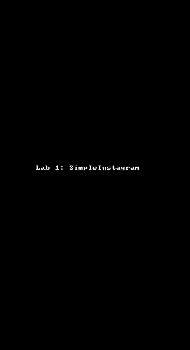

# simple-instagram-codepath
Simple Insagram App for Pair Programming

Team members:
1. Sarn Wattanasri
2. Oranuch Tangdechavut

# Lab 1 - *Simple Instagram*

Time spent: 2 hours spent in total

## Features

The following features are complete:

- [x] Main photo feed
- [x] User profile images and name
- [x] Header view that includes profile view
- [x] Custom AppIcon and launch screen

Library used:
- AFNetworking

## Video Walkthrough 

Here's a walkthrough of implemented features:

GIF created with [LiceCap](http://www.cockos.com/licecap/).

